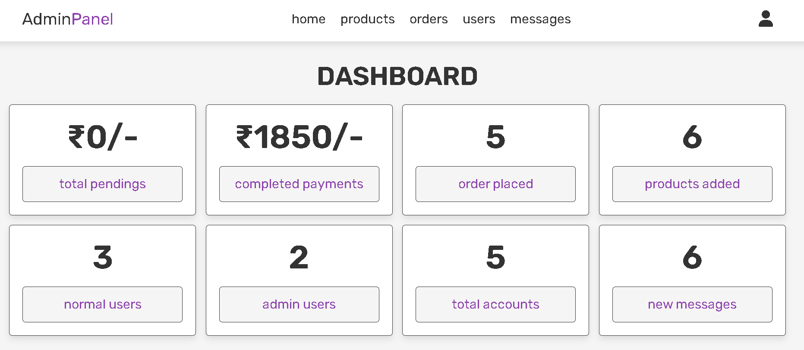

# Online Book Selling Website

A PHP-based online book selling web application with admin and user features.

## Features
- User login & registration
- Browse and search books
- Add to cart & checkout
- Admin panel for managing books and orders

## Tech Stack
- PHP
- HTML, CSS, JavaScript
- MySQL (XAMPP / phpMyAdmin)

## How to Run
1. Copy the project folder into `xampp/htdocs`
2. Import `shop_db.sql` into phpMyAdmin
3. Start Apache & MySQL in XAMPP
4. Open in browser: http://localhost/booksellingweb

5. ## 📸 Project Screenshots

### 🏠 Home Page

### 🛒 Shop Page

### 🛠️ Admin Panel

